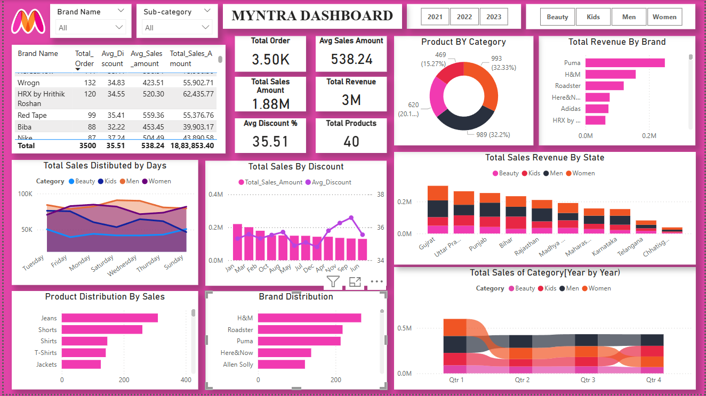

# Myntra Sales Data Analysis - Power BI Report

## 📌 Project Overview
This repository contains a comprehensive Power BI report analyzing Myntra's sales data. The report provides key insights into sales trends, customer behavior, product performance, and revenue generation. It includes interactive visualizations, KPIs, and filters to explore the dataset effectively.

## 📊 Dataset Overview
The dataset consists of four main tables:
1. **dim_products** - Contains product details such as product name, category, sub-category, and brand.
2. **dim_customers** - Stores customer-related data, including customer ID, location, and demographics.
3. **fact_orders** - Contains transactional data such as order ID, order date, sales amount, discount percentage, and revenue.
4. **Date Table** - Created for reference and better analysis, containing columns like date, month, month number, week number, weekday, and year.

## 🏗️ Power BI Implementation
### **1. Data Modeling**
- Created relationships between **dim_products**, **dim_customers**, **fact_orders**, and the **Date Table**.
- Developed a **Date Table** to enable time-based analysis.

### **2. Measures Created (DAX Calculations)**
- **Total Orders**
- **Total Sales Amount**
- **Average Sales Amount**
- **Average Discount Percentage**
- **Avg Original Price**
- **Avg Ratings**
- **Sum Original Price**

### **3. Filters Applied**
Users can filter the data using:
- **Brand Name**
- **Category** (Beauty, Kids, Men, Women)
- **Sub-Category**
- **Year**

### **4. Visualizations Used**
- **Table**: Displays detailed sales data.
- **Donut Chart**: Shows product distribution by category.
- **Stacked Bar Chart**: Analyzes total revenue by brand and product distribution by sales.
- **Stacked Column Chart**: Visualizes total sales revenue by state.
- **Line and Clustered Column Chart**: Shows total sales by discount percentage.
- **Area Chart**: Represents total sales distributed by days.
- **Ribbon Chart**: Displays year-over-year total sales by category.

## 📈 Power BI Live Dashboard
You can view the interactive Power BI dashboard using the link below:
🔗 **[Live Power BI Dashboard](https://app.powerbi.com/view?r=eyJrIjoiMWFkNGUwMDUtNGMxYy00NmE3LWFhNTEtZDIyNTdhMjEzYmFhIiwidCI6ImM2ZTU0OWIzLTVmNDUtNDAzMi1hYWU5LWQ0MjQ0ZGM1YjJjNCJ9)**

### 📊 Project Dashboard View
Below is a screenshot of the Myntra Sales Dashboard:
 *(Replace with actual image link in the repository)*

## 📈 Key Insights
- **Top-selling brands and categories** contributing the most to sales.
- **Geographical distribution** of sales revenue across different states.
- **Impact of discounts** on total sales.
- **Seasonal trends** in Myntra sales over time.

## 🛠️ Applications Used
- **Power BI** - For data visualization and dashboard creation.
- **Excel** - For data preprocessing and cleaning.
- **Google** - Data was downloaded from online sources.

## 🔧 How to Use
1. **Download the Power BI report (.pbix file)** from this repository.
2. Open the report in **Power BI Desktop**.
3. Explore insights using filters and interactive visuals.

## 📝 Conclusion
This Power BI report provides a deep dive into Myntra’s sales performance, helping businesses make data-driven decisions. Future improvements can include predictive analytics and customer segmentation for targeted marketing.

